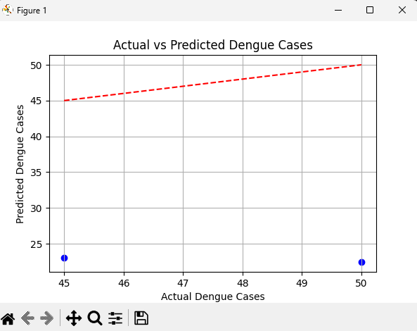

# Dengue_Risk_Prediction
# 🦟 Dengue Risk Prediction Project

## 🌍 SDG Alignment
**SDG 3 – Good Health & Well-being**  
This project addresses the challenge of **dengue outbreaks** by predicting the risk of dengue cases in different cities. Early prediction allows health authorities to allocate resources, raise awareness, and reduce outbreak risks.

---

## 📌 Project Overview
This project uses **machine learning (Random Forest)** to predict dengue cases per city per week based on weather and city data.  
By leveraging supervised learning, the model identifies high-risk areas and supports better decision-making for public health.

**Key Features:**
- Data preprocessing (cleaning, normalization, train/test split).  
- Model training with Random Forest.  
- Evaluation using accuracy, precision, recall, and F1-score.  
- Visualizations of dengue cases and model performance.  

---

## 📊 Dataset
- Source: [Kaggle / WHO / Public Health Data] (replace with your actual source)  
- Features: weather data, location info, and case counts.  
- Target: dengue outbreak risk (low/high cases).  

---

## 🛠️ Tools & Libraries
- Python (Scikit-learn, Pandas, Matplotlib, Seaborn)  
- Jupyter Notebook / Google Colab  
- GitHub for version control  

---

## 🤖 Machine Learning Approach
- **Type:** Supervised Learning (Classification)  
- **Algorithm:** Random Forest Classifier  
- **Steps:**
  1. Data preprocessing (handle missing values, split train/test).  
  2. Train Random Forest on historical dengue data.  
  3. Evaluate predictions with metrics.  
  4. Visualize feature importance & ROC curve.  

---

## 📈 Results
- **Accuracy:** ~ (fill in)  
- **Precision:** ~ (fill in)  
- **Recall:** ~ (fill in)  
- **F1-score:** ~ (fill in)  

Example visualization:  

  

(Add ROC curve/confusion matrix screenshot here once you run it.)  

---

## ⚖️ Ethical Reflection
- **Bias:** If the dataset only represents certain cities, predictions may not generalize fairly.  
- **Privacy:** Sensitive health data must be anonymized.  
- **Fairness:** Predictions should be used to **support communities**, not penalize them.  
- **Sustainability:** Early prediction helps reduce healthcare burden and save lives.  

---

## 🖼️ Presentation
📑 [View the 5-minute Demo Pitch Deck](./Dengue_PitchDeck.pdf.pdf)

---

## 📝 Report
📄 [Read the Project Report](./report/Dengue_Report.pdf)  

---

## 🚀 How to Run
1. Clone the repo:  
   ```bash
   git clone https://github.com/UmChristelle/Dengue_Risk_Prediction.git
   cd Dengue_Risk_Prediction
